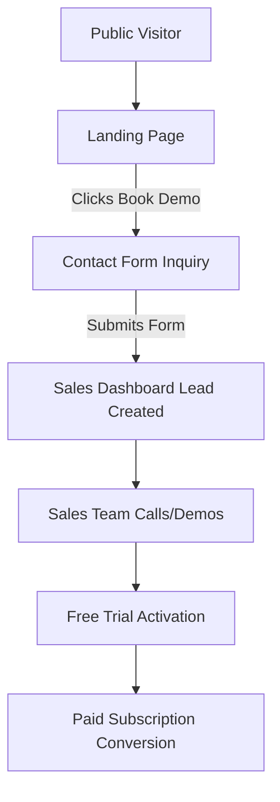
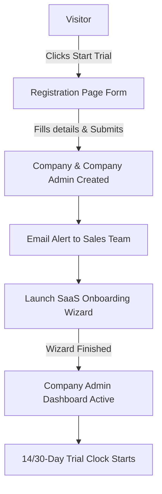

# Hero Logistics System - Pre-Login & Auth Module Wireframes

This document details the page structures, wireframes (using ASCII layouts), component hierarchies, field definitions, and user flows for the **Pre-Login Module** and **Authentication Module** of the Hero Logistics System.

---

## 1. Landing Website Wireframe

The landing website is the public-facing portal designed to educate visitors, showcase features, and capture leads/signups.

### 1.1 Sticky Header Layout
```
+-----------------------------------------------------------------------------------------------------------------------+
|  [Logo] HERO LOGISTICS      Home   Features   Solutions   Pricing   Integrations   About Us   Contact     [Login] [Start Trial] |
+-----------------------------------------------------------------------------------------------------------------------+
```
* **Behavior:** Sticky to the top of the viewport on scroll. Semi-transparent backdrop with blur filter (glassmorphism).
* **Navigation Links:**
  * Home (Scrolls to top)
  * Features (Scrolls to Features section)
  * Solutions (Scrolls to Solutions section)
  * Pricing (Scrolls to Pricing section)
  * Integrations (Scrolls to Integrations section)
  * About Us (Navigates to company info page or section)
  * Contact (Scrolls to Contact section)
* **Actions:**
  * `[Login]` -> Redirects to Login Page
  * `[Start Trial]` -> Redirects to Register Page (CTA style)

---

### 1.2 Hero Section Layout
```
+-----------------------------------------------------------------------------------------------------------------------+
|                                                                                                                       |
|   COMPLETE LOGISTICS OPERATING SYSTEM                                   +-----------------------------------------+   |
|                                                                         |        Logistics Dashboard Preview      |   |
|   Manage Loads, Dispatch, Drivers, Warehouses, Billing,                 |                                         |   |
|   Payroll and Customer Tracking from one powerful platform.             |  +-------------------+  +------------+  |   |
|                                                                         |  | Driver App Preview |  | GPS Map   |  |   |
|   [Start Free Trial (Primary CTA)]      [Book Live Demo (Secondary)]    |  +-------------------+  +------------+  |   |
|                                                                         +-----------------------------------------+   |
|                                                                                                                       |
+-----------------------------------------------------------------------------------------------------------------------+
```
* **Left Column:** Headlines, subheadline, and primary/secondary call-to-actions.
* **Right Column:** A floating showcase of mockups:
  * Admin/Dispatch Dashboard Preview (Large background)
  * Driver Mobile App Mockup (Layered front-left)
  * Live GPS Tracking Map Interface (Layered front-right)

---

### 1.3 Trusted By Section
```
+-----------------------------------------------------------------------------------------------------------------------+
|                                  TRUSTED BY LEADING LOGISTICS COMPANIES NATIONWIDE                                    |
|                                                                                                                       |
|        [ 1,200+ ]                  [ 15,000+ ]                  [ 5M+ ]                     [ 4.9/5 ★ ]               |
|     Active Companies             Active Drivers            Loads Processed               Customer Rating              |
|                                                                                                                       |
+-----------------------------------------------------------------------------------------------------------------------+
```
* **Layout:** Centered inline grid of 4 key performance metrics with slow counting animations on page load.

---

### 1.4 Features Section (8-Card Grid)
```
+-----------------------------------------------------------------------------------------------------------------------+
|                                             POWERFUL BUILT-IN FEATURES                                                |
|                                                                                                                       |
|   +--------------------------+  +--------------------------+  +--------------------------+  +--------------------------+ |
|   | [Icon] Load Management   |  | [Icon] Dispatch Planning |  | [Icon] Driver App        |  | [Icon] GPS Tracking      | |
|   | Efficient dispatching,   |  | Smart routing, schedules |  | Offline support, POD     |  | Live coordinates, path   | |
|   | load status updates, UI. |  | and driver assign tools. |  | capture and route nav.   |  | history, geofencing.     | |
|   +--------------------------+  +--------------------------+  +--------------------------+  +--------------------------+ |
|                                                                                                                       |
|   +--------------------------+  +--------------------------+  +--------------------------+  +--------------------------+ |
|   | [Icon] Warehouse Mgmt    |  | [Icon] Billing & Payroll |  | [Icon] Customer Portal   |  | [Icon] AI Automation     | |
|   | Inventory tracking, bin  |  | Automated invoices, rate |  | Client shipment visibility| | Smart dispatch matching, | |
|   | allocation & scanning.   |  | sheets, driver payroll.  |  | and direct load booking. |  | ETA forecasting.         | |
|   +--------------------------+  +--------------------------+  +--------------------------+  +--------------------------+ |
+-----------------------------------------------------------------------------------------------------------------------+
```

---

### 1.5 Solutions Section (Industry Breakdown)
```
+-----------------------------------------------------------------------------------------------------------------------+
|                                           SOLUTIONS TAILORED FOR YOUR INDUSTRY                                         |
|                                                                                                                       |
|      ( ) General Freight     ( ) Car Carrying         ( ) Courier                                                     |
|      ( ) Fleet Management    ( ) Warehouse Operations  ( ) 3PL Logistics                                               |
|                                                                                                                       |
|   +---------------------------------------------------------------------------------------------------------------+   |
|   |  [Solution Visual / Icon]                                                                                     |   |
|   |  Detailed description of how Hero Logistics handles the selected industry pipeline.                           |   |
|   |  * Feature bullet 1                                                                                           |   |
|   |  * Feature bullet 2                                                                                           |   |
|   |  [Learn More / Get Started Button]                                                                            |   |
|   +---------------------------------------------------------------------------------------------------------------+   |
+-----------------------------------------------------------------------------------------------------------------------+
```
* **UX Idea:** Tabs on top (General Freight, Car Carrying, etc.). Clicking a tab dynamically transitions the content block below to present industry-specific capabilities.

---

### 1.6 Product Screenshots Gallery
```
+-----------------------------------------------------------------------------------------------------------------------+
|                                          SYSTEM INTERFACE WALKTHROUGH                                                 |
|                                                                                                                       |
|      [ Admin Dashboard ]   [ Dispatch Board ]   [ Driver App ]   [ Warehouse Panel ]   [ Accounts ]   [ Customer ]    |
|                                                                                                                       |
|   +---------------------------------------------------------------------------------------------------------------+   |
|   |                                                                                                               |   |
|   |                                       [ SCREENSHOT PLACEHOLDER ]                                              |   |
|   |                                       Full Dashboard Screenshot UI                                            |   |
|   |                                                                                                               |   |
|   +---------------------------------------------------------------------------------------------------------------+   |
|      < Previous                                                                                             Next >    |
+-----------------------------------------------------------------------------------------------------------------------+
```
* **Layout:** Carousel structure with tab selectors on top and pagination buttons on the bottom.

---

### 1.7 Pricing Section (3-Column Layout)
```
+-----------------------------------------------------------------------------------------------------------------------+
|                                            PRICING PLANS TO FIT YOUR SCALE                                            |
|                                                                                                                       |
|     +----------------------------+     +----------------------------+     +----------------------------+              |
|     | STARTER                    |     | PROFESSIONAL               |     | ENTERPRISE                 |              |
|     | For growing teams          |     | For mid-sized fleets       |     | For enterprise logistics   |              |
|     |                            |     |                            |     |                            |              |
|     |  $49 / month               |     |  $149 / month              |     |  Custom Pricing            |              |
|     |                            |     |                            |     |                            |              |
|     |  * Up to 5 Trucks          |     |  * Up to 25 Trucks         |     |  * Unlimited Trucks        |              |
|     |  * Basic Dispatch          |     |  * Advanced Routing & GPS  |     |  * Full System Suite       |              |
|     |  * Driver App Access       |     |  * Invoicing & Payroll     |     |  * Custom Integrations     |              |
|     |  * Email Support           |     |  * Priority 24/7 Support   |     |  * Dedicated Account Mgr   |              |
|     |                            |     |                            |     |                            |              |
|     |   [Start Free Trial]       |     |   [Start Free Trial]       |     |   [Contact Sales]          |              |
|     +----------------------------+     +----------------------------+     +----------------------------+              |
+-----------------------------------------------------------------------------------------------------------------------+
```

---

### 1.8 Integrations Section
```
+-----------------------------------------------------------------------------------------------------------------------+
|                                         WORKS WITH THE TOOLS YOU ALREADY USE                                          |
|                                                                                                                       |
|    [ Google Maps ]       [ Stripe ]        [ Razorpay ]        [ WhatsApp ]        [ Twilio ]       [ GPS Hardware ]  |
|      (Routing/Map)      (US Payments)     (IN Payments)      (Notifications)      (SMS Alerts)      (Telematics API)  |
|                                                                                                                       |
+-----------------------------------------------------------------------------------------------------------------------+
```

---

### 1.9 Testimonials Section
```
+-----------------------------------------------------------------------------------------------------------------------+
|                                          WHAT OUR CUSTOMERS ARE SAYING                                                |
|                                                                                                                       |
|   +---------------------------------------+  +---------------------------------------+  +---------------------------+ |
|   | "Hero Logistics doubled our dispatch  |  | "The driver app is so simple that our |  | "Accounts dashboard saved | |
|   | efficiency in 2 months!"              |  | older drivers picked it up instantly."|  | us 10+ hours a week."     | |
|   |                                       |  |                                       |  |                           | |
|   | - Rajesh K., CEO of Falcon Logistics  |  | - Sarah M., Dispatch Director         |  | - Amit S., CFO, RedExpress| |
|   +---------------------------------------+  +---------------------------------------+  +---------------------------+ |
+-----------------------------------------------------------------------------------------------------------------------+
```

---

### 1.10 FAQ Section (Accordion Style)
```
+-----------------------------------------------------------------------------------------------------------------------+
|                                             FREQUENTLY ASKED QUESTIONS                                                |
|                                                                                                                       |
|   [+] How long does the setup take?                                                                                   |
|   [+] Can we import our existing customer database?                                                                   |
|   [-] What happens after my free trial ends?                                                                          |
|       Your trial company remains active, but you must subscribe to a plan to continue dispatching loads.              |
|       All your configured details (branches, drivers, vehicles) will be saved.                                        |
|   [+] Does it support offline logging for drivers?                                                                     |
+-----------------------------------------------------------------------------------------------------------------------+
```

---

### 1.11 Contact & Lead Generation Form
```
+-----------------------------------------------------------------------------------------------------------------------+
|                                               GET IN TOUCH WITH US                                                    |
|                                                                                                                       |
|    Talk to our sales team or book a personalized demo showing how Hero Logistics fits your pipeline.                  |
|                                                                                                                       |
|    Full Name:      [____________________________]      Email:        [____________________________]                  |
|    Company Name:   [____________________________]      Phone Number: [____________________________]                  |
|                                                                                                                       |
|    Message:        [______________________________________________________________________________]                  |
|                                                                                                                       |
|                    [  Send Inquiry (Primary)  ]         [  Book Live Demo (Secondary)  ]                              |
|                                                                                                                       |
+-----------------------------------------------------------------------------------------------------------------------+
```

---

### 1.12 Footer Layout
```
+-----------------------------------------------------------------------------------------------------------------------+
|  HERO LOGISTICS           Product             Solutions           Company             Resources                       |
|                           - Features          - General Freight   - About Us          - Documentation                 |
|  (C) 2026 Hero Systems    - Pricing           - Car Carrying      - Contact           - Help Center                   |
|  All rights reserved.     - Integrations      - 3PL Operations    - Careers           - Support                       |
|                                                                                                                       |
|  [Privacy Policy]  |  [Terms of Service]  |  [Login Portal]                                                           |
+-----------------------------------------------------------------------------------------------------------------------+
```

---
---

## 2. Authentication Screens

All authentication forms should be centered inside a responsive container with clear feedback states, field validation, and social login redirects.

### 2.1 Login Page
```
+-----------------------------------------------------------------------+
|                                                                       |
|                             HERO LOGISTICS                            |
|                            Sign in to Portal                          |
|                                                                       |
|    Email Address                                                      |
|    [______________________________________________________________]   |
|                                                                       |
|    Password                                                           |
|    [______________________________________________________________]   |
|    [x] Remember this device                [Forgot Password?]         |
|                                                                       |
|    [                    Login to Account                          ]   |
|                                                                       |
|    -------------------------- OR ----------------------------------   |
|                                                                       |
|    [ G Continue with Google                                       ]   |
|    [ M Continue with Microsoft                                    ]   |
|                                                                       |
|    Don't have an account? [Register / Start Trial]                    |
|    Need assistance? [Contact Support]                                 |
|                                                                       |
+-----------------------------------------------------------------------+
```
* **Validation:** 
  * Required fields checked on submit.
  * Real-time email format verification.
  * Lock accounts temporarily after 5 consecutive failed logins.

---

### 2.2 Register Page (Trial Signup)
```
+-----------------------------------------------------------------------+
|                                                                       |
|                             HERO LOGISTICS                            |
|                        Create Your Trial Account                      |
|                                                                       |
|    Company Name                                                       |
|    [______________________________________________________________]   |
|                                                                       |
|    Full Name                                                          |
|    [______________________________________________________________]   |
|                                                                       |
|    Business Email                                                     |
|    [______________________________________________________________]   |
|                                                                       |
|    Phone Number                                                       |
|    [______________________________________________________________]   |
|                                                                       |
|    Password                                                           |
|    [______________________________________________________________]   |
|                                                                       |
|    Confirm Password                                                   |
|    [______________________________________________________________]   |
|                                                                       |
|    [x] I agree to the Terms of Service & Privacy Policy               |
|                                                                       |
|    [                Create Account & Start Trial                  ]   |
|                                                                       |
|    Already have an account? [Login Portal]                            |
|                                                                       |
+-----------------------------------------------------------------------+
```

---

### 2.3 Forgot Password Page
```
+-----------------------------------------------------------------------+
|                                                                       |
|                             HERO LOGISTICS                            |
|                            Forgot Password                            |
|                                                                       |
|    Enter the email address associated with your account. We will send |
|    you a secure link to reset your password.                          |
|                                                                       |
|    Email Address                                                      |
|    [______________________________________________________________]   |
|                                                                       |
|    [                   Send Reset Link                            ]   |
|                                                                       |
|    [ Back to Login ]                                                  |
|                                                                       |
+-----------------------------------------------------------------------+
```

---

### 2.4 Reset Password Page
```
+-----------------------------------------------------------------------+
|                                                                       |
|                             HERO LOGISTICS                            |
|                            Reset Password                             |
|                                                                       |
|    Create a new password for your account. Make sure it contains      |
|    numbers, symbols, and is at least 8 characters long.               |
|                                                                       |
|    New Password                                                       |
|    [______________________________________________________________]   |
|                                                                       |
|    Confirm Password                                                   |
|    [______________________________________________________________]   |
|                                                                       |
|    [                  Update Password                             ]   |
|                                                                       |
+-----------------------------------------------------------------------+
```

---
---

## 3. SaaS Onboarding Wizard (Post-Signup Setup)

After successful trial registration, users are guided through a multi-step wizard before accessing their main dashboard.

### 3.1 Wizard Wrapper & Progress Tracker Layout
```
+-----------------------------------------------------------------------------------------------------------------------+
| [Logo] HERO LOGISTICS                                                                               Setup Completion  |
|                                                                                                                       |
|  ( Step 1 ) ======= ( Step 2 ) ======= ( Step 3 ) ======= ( Step 4 ) ======= ( Step 5 ) ======= ( Step 6 )            |
|   Company            Branches            Users            Vehicles          Customers          Complete               |
|                                                                                                                       |
| +-------------------------------------------------------------------------------------------------------------------+ |
| |                                                                                                                   | |
| |                                       [ CURRENT STEP WORKSPACE ]                                                  | |
| |                                                                                                                   | |
| +-------------------------------------------------------------------------------------------------------------------+ |
|                                                                                                                       |
|                                                     [ Back ]  [ Save & Continue ]  (or Skip Step if optional)         |
+-----------------------------------------------------------------------------------------------------------------------+
```

---

### 3.2 Step Contents & Inputs

#### Step 1: Company Details
* **Purpose:** Collect basic company identity details.
* **Fields:**
  * Company Legal Name `[Input]`
  * Tax ID / VAT Number / GSTIN `[Input]`
  * Logo Upload `[File Drag & Drop]`
  * Primary Currency `[Dropdown]`
  * Timezone `[Dropdown]`

#### Step 2: Branch Setup
* **Purpose:** Create initial physical/operational hubs.
* **Fields:**
  * Branch Name (e.g., HQ, Chicago Depot) `[Input]`
  * Address Line 1 & 2 `[Input]`
  * City, State, Country, Zip Code `[Input]`
  * Branch Manager Email `[Input]`
  * Add Branch Button `[+]` (Allows adding multiple branches before continuing)

#### Step 3: Add Users
* **Purpose:** Team members invites.
* **Fields / UI:**
  * List of invites configured: `[Table with Name, Email, Role, Actions]`
  * Invite New User Modal/Form:
    * Name `[Input]`
    * Email `[Input]`
    * System Role Selector: `[Super Admin, Company Admin, Dispatcher, Driver, Warehouse Manager, Yard Attendant, Accounts]`
  * Invite Trigger Button `[Send Invitation]`

#### Step 4: Add Vehicles (Fleet Setup)
* **Purpose:** Seed fleet vehicles to support dispatch matches immediately.
* **Fields:**
  * Vehicle Plate/Registration Number `[Input]`
  * VIN (Optional) `[Input]`
  * Vehicle Type `[Dropdown: Semi-Truck, Flatbed, Box Truck, Van, Car Carrier]`
  * Capacity / Max Weight Load (lbs/kg) `[Input]`
  * Current Location/Branch Assignment `[Dropdown]`

#### Step 5: Add Customers
* **Purpose:** Register initial shippers/customers for billing and load assignments.
* **Fields:**
  * Customer Name / Company Name `[Input]`
  * Primary Contact Person `[Input]`
  * Billing Email `[Input]`
  * Billing Address `[Input]`
  * Payment Terms `[Dropdown: Net 15, Net 30, Due on Receipt]`

#### Step 6: Complete Setup
* **Purpose:** Activation confirmation.
* **UI Content:**
  * Checked success animation.
  * Summary cards showing:
    * Company Created: `[Company Name]`
    * Branches Added: `[Number]`
    * Users Invited: `[Number]`
    * Fleet Size: `[Number]`
    * Shippers Configured: `[Number]`
  * Action Button: `[ Launch Company Dashboard ]` -> Redirects to the main dashboard.

---
---

## 4. Workflows & Internal Rules

### 4.1 Lead Generation Workflow


### 4.2 Trial Signup Flow


### 4.3 Multi-Role Login Redirect Rules
Users login through a unified email/password portal. On authentication, the backend reads their assigned system role and triggers the correct router redirection.

| Role | Landing Destination | Description / Dashboard Focus |
| :--- | :--- | :--- |
| **Super Admin** | `Super Admin Dashboard` | SaaS platform-wide metrics, system settings, plan configs, and tenant management. |
| **Sales** | `Sales Dashboard` | Leads pipelines, inquiries, demo schedules, and trial conversion tracking. |
| **Company Admin** | `Company Dashboard` | Full control over the specific company, users, billing, fleet, and settings. |
| **Dispatcher** | `Dispatch Dashboard` | Active loads dashboard, GPS maps, vehicle assignment, planning boards, and chat. |
| **Driver** | `Driver App (Mobile View)` | Task lists, active loads navigation, proof of delivery (POD) capture, and status updates. |
| **Warehouse Manager**| `Warehouse Panel` | Receiving, shipping, stock transfers, bin allocation, and scan logs. |
| **Yard Attendant** | `Yard Panel / App` | Gate-in/gate-out logs, trailer spot tracking, and container management. |
| **Accounts** | `Accounts Panel` | Invoices, payout calculations, receipts, payroll approvals, and ledger integration. |
| **Customer** | `Customer Portal` | Load status tracking, booking forms, past invoices, and rate agreements. |
